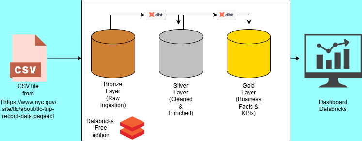

- NYC Taxi Analytics Pipeline (Databricks + dbt)
- Project Overview

This project is an end-to-end analytics engineering pipeline built on the NYC Yellow Taxi dataset, demonstrating how raw data can be transformed into business-ready insights using Databricks and dbt.

The solution follows a Bronze → Silver → Gold architecture and culminates in executive dashboards answering real business questions around demand, revenue, locations, and payment behavior.

- Architecture Overview

  

- Tech Stack

Databricks (Community Edition)

Apache Spark (SQL & PySpark)

dbt (Core)

Delta Lake

Git / GitHub

NYC TLC Public Dataset

- Data Layers
- Bronze Layer

Purpose: Raw data ingestion with minimal transformation

Source: NYC Yellow Taxi Parquet files

Storage: Delta tables

Characteristics:

No business logic

Schema preserved

Acts as immutable raw source

- Silver Layer

Purpose: Data cleaning and standardization

Key transformations:

Filtered invalid records:

trip_distance > 0

passenger_count > 0

Valid pickup/dropoff timestamps

Added derived fields:

trip_duration_minutes

Selected relevant analytical columns

Ensured data quality with dbt tests

Example:

trip_duration_minutes = datediff(
  minute,
  tpep_pickup_datetime,
  tpep_dropoff_datetime
)

- Gold Layer

Purpose: Business-ready fact tables

Created multiple fact tables for analytics and reporting:

- Daily KPIs

fct_nyc_taxi_daily_kpis

Total trips

Total revenue

Average fare

Average trip distance

Average trip duration

- Pickup Location Performance

fct_nyc_taxi_pickup_location

Trips by pickup location

Revenue by pickup location

Ranked Top-N locations

- Payment & Tip Analysis

fct_nyc_taxi_payment_analysis

Trips by payment type

Correctly calculated average tip percentage

SUM(tip_amount) / SUM(fare_amount) * 100

- Dashboards

All dashboards are built only on Gold tables.

- Dashboard 1 — Executive Overview

Total trips

Total revenue

Trips over time

Revenue over time

- Dashboard 2 — Pickup Location Performance

Top 10 pickup locations by trips

Top 10 pickup locations by revenue

- Dashboard 3 — Payment & Tip Behavior

Trips by payment type

Revenue by payment type

- Data Quality & Testing

dbt tests implemented:

not_null

unique (where applicable)

Key learnings:

Percentages should never be summed

Aggregated KPIs must be calculated at the correct grain

Business validation is as important as SQL correctness

- Key Learnings

Designing Bronze–Silver–Gold pipelines

Writing production-style dbt models

Handling real-world metric pitfalls (e.g. tip percentages)

Translating business questions into analytical models

Building executive dashboards with defensible metrics

- Dataset

NYC Yellow Taxi Trip Records

Public dataset provided by NYC TLC

https://www.nyc.gov/site/tlc/about/tlc-trip-record-data.page

- Future Improvements

Add dimension tables (locations, payment types)

Implement surrogate keys

Incremental dbt models

Slowly Changing Dimensions (SCD)

Metric documentation (metrics.yml)

CI for dbt tests

- Author

Built by Selman Bytyqi
Aspiring  Data Engineer
Focused on Databricks, dbt, and analytics engineering best practices

- Notes

This project was built using Databricks Community Edition, demonstrating how professional-grade analytics workflows can be developed even in constrained environments.
